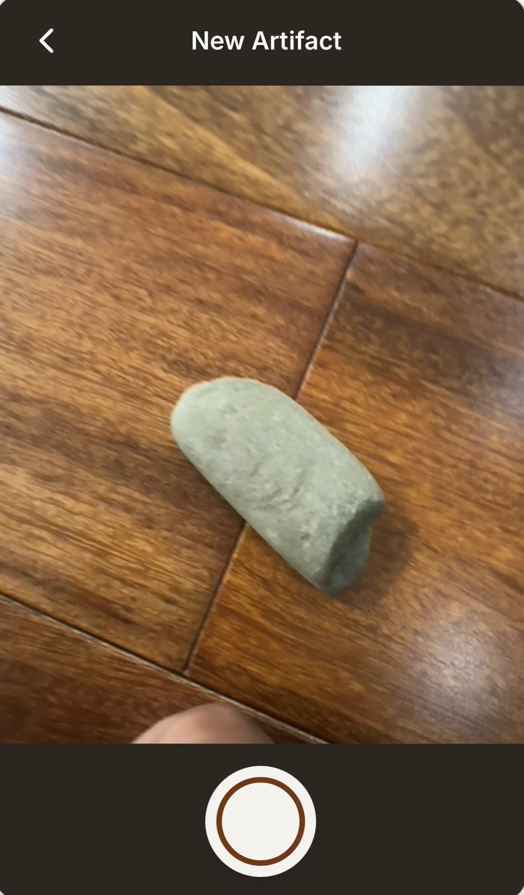
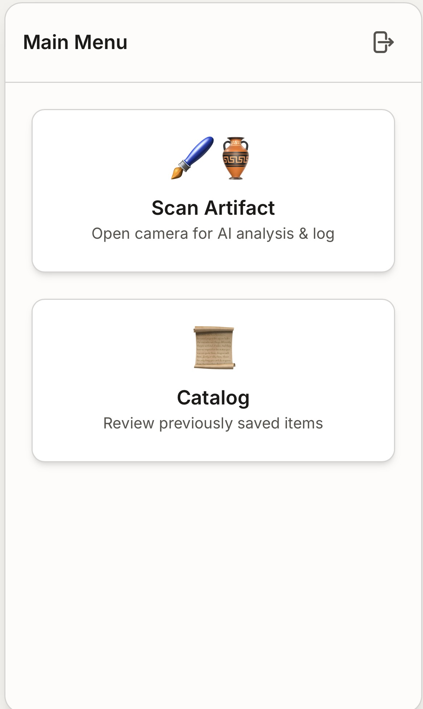
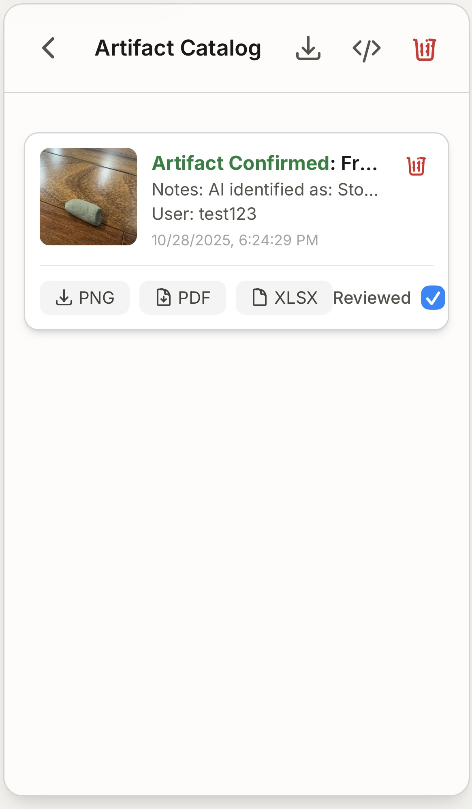

BOB - Field Cataloger & Analyzer

Purpose
-------
BOB is a lightweight browser-based application designed to assist archaeologists in the field by automatically cataloging photographed objects using AI. The app captures images from a camera, sends images to a generative AI (Gemini / Generative Language API) for classification and description, and stores artifact records in Firebase Firestore. It also provides export options (PDF, XLSX, JSON) and a small in-browser catalog UI.

How to use BOB
-----------
You can access the app https://cody-barlowe1337.github.io/Innovation_Project_FLL_25-26/ 

Open the app and take a picture of your artifact.
	
On the next screen, the AI will analyze your image and provide suggestions about your artifact’s attributes.
To save this analysis, tap the Save button in the top right corner.
You’ll be returned to the camera page. To view your saved analyses, tap the Back arrow in the top left to go to the Home page.
From there, select Catalog to open your collection of saved artifacts.
	

In the catalog, you can:

* Review or confirm a saved analysis

* Delete an individual entry

* Download a log as a PDF, PNG, or XLSX (Excel sheet)

* You can also save all or delete all catalog entries using the buttons in the top right corner.

Repeat these steps to add and catalog more artifacts!
   

Key Features
------------
- Capture images from device camera (getUserMedia) and preview before submitting.
- AI analysis of images to classify whether the object is an archaeological artifact and provide a short description and material.
- Persistent storage using Firebase Firestore (real-time listeners, authentication).
- Export individual artifacts as PDF/XLSX and bulk export (XLSX/JSON).
- Local development mode: the app can run with no Firebase or Gemini keys for quick testing; a mock analyzer will produce deterministic responses.

Technical Stack
---------------
- Single-file front-end: `index.html` (HTML, CSS, JS)
- Tailwind CSS via CDN for styling
- Firebase Web SDK (v11.6.1) for Firestore and Authentication
- Generative Language API (Gemini) via REST for image analysis
- jsPDF for PDF export
- SheetJS (xlsx) for Excel exports

Contributors
----------------------
Vihaan Parmar,
Deetyam Soni,
Akshaj Narayan,
and Yuvansh Haval

Contact / Contribution
----------------------
Open an issue or pull request with improvements. Include device/browser details when reporting camera-related issues.
